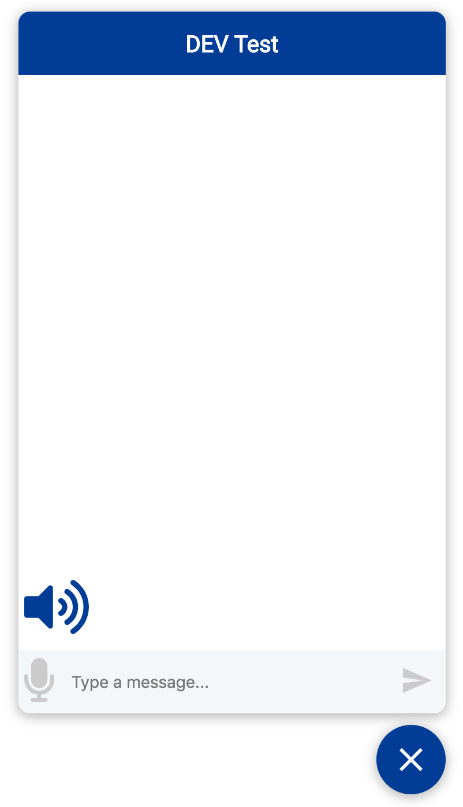

# Webchat with ASR and TTS

A simple webchat with automatic speech recognition (ASR) and text-to-speech (TTS) to connect with a chatbot. Forked from [rasa-webchat](https://github.com/mrbot-ai/rasa-webchat).

## Extension

We extent the original project with:

- a `speaker` component for speech output,
- a `mircophone` component for speech input and
- an option to use cloud services from Mircosoft Cloud Service Azure for ASR 

For providing this feature we used the [Open Source Framework](https://github.com/lingualogic/speech-framework) by [LinguaLogic](https://lingualogic.de/) with the [SDK for React](https://github.com/lingualogic/speech-react).

### Speaker
The color of the speaker button indeciades, if the TTS is activ.
Is the icon blue, messages of bot will be a speech output. 
Click on the icon to deactivate the TTS.

### Mircophone
By clicking on the mircophone button the ASR starts. The recognized text gets displayed on the input field and can be send afterwards.

### Mircosoft Cloud Service
The default engine for ASR is based on HTML5, which only works on Chrome browser. To enable ASR for all browers the Mircosoft Speech-to-Text service can be used. Therefore a [speech resource](https://docs.microsoft.com/de-de/azure/cognitive-services/speech-service/get-started#create-a-speech-resource-in-azure) in Azure needs to be created. Afterwards region and key gets set in `credentials/mircosoft-credentials.js`.

## Note
For more information to Setup, Usage, API, Styles and Usage with Docker of the webchat see the [original project](https://github.com/mrbot-ai/rasa-webchat).

Thanks to the Contributors:
[@PHLF](https://github.com/phlf)
[@znat](https://github.com/znat)
[@TheoTomalty](https://github.com/TheoTomalty)
[@Hub4IT](https://github.com/Hub4IT)
[@dliuproduction](https://github.com/dliuproduction)
[@MatthieuJnon](https://github.com/MatthieuJnon)
[@LeonardMF](https://github.com/LeonardMF)
